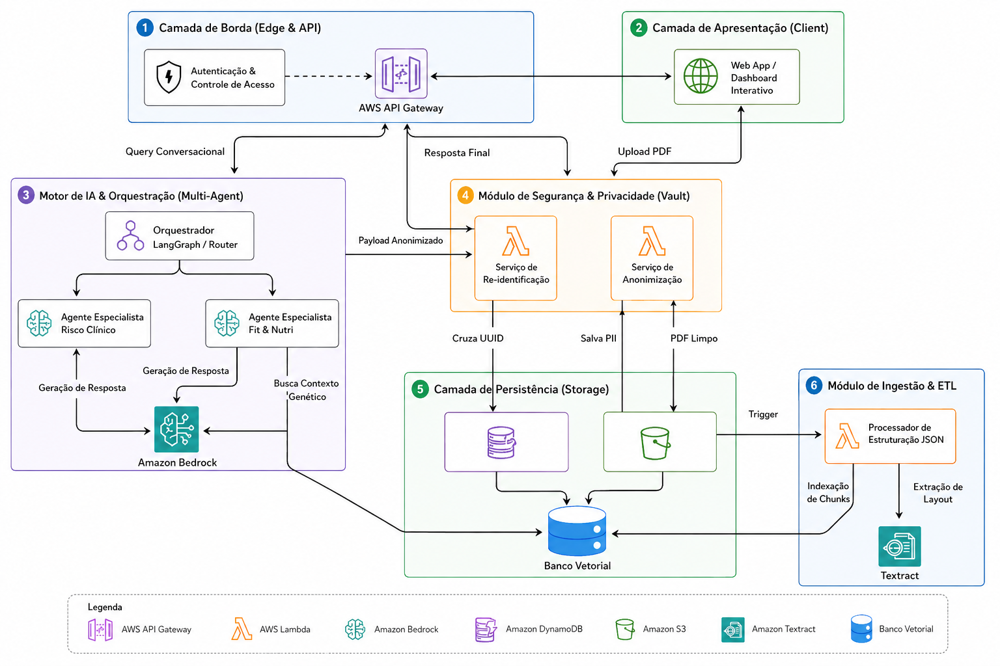

# FIAP - Faculdade de Informática e Administração Paulista

<p align="center">
<a href= "https://www.fiap.com.br/"></a>
</p>

<br>

# Genera Intelligence: RAG Multimodelo para Laudos Genéticos (Sprint 3)

## Grupo: Squad AI Engineering

## 👨‍🎓 Integrantes: 
- <a href="https://www.linkedin.com/in/arthur-alentejo">Arthur Guimarães Alentejo</a>
- <a href="https://www.linkedin.com/in/michaelrodriguess">Michael Rodrigues</a>
- <a href="https://www.linkedin.com/in/nathalia-vasconcelos-18a390292/">Nathalia Vasconcelos</a> 

## 👩‍🏫 Professores:
### Tutor(a) 
- <a href="#">Caique (CaiqueFiap-2026)</a>
### Coordenador(a)
- <a href="https://www.linkedin.com/in/andregodoichiovato/">André Godói</a>

---

## ⚠️ Nota Técnica Arquitetural (Sprint 2)
Para a avaliação desta etapa focada em Inteligência Artificial, a equipe adotou uma estratégia de mitigação de risco no pipeline de ingestão. Em vez de executar o OCR (Textract) em tempo real nos arquivos PDF de origem, **os laudos foram previamente convertidos e padronizados no arquivo `proposta_estrutura_de_dados.json`**. 

Esta decisão permite que a equipe concentre todos os esforços no que realmente importa nesta Sprint: a **implementação do motor RAG, a orquestração de múltiplos agentes via LangGraph e a engenharia de prompts**, garantindo respostas semânticas altamente precisas e ancoradas em dados estruturados.

---

## 🎨 Evolução da Experiência do Usuário (Sprint 3)

A Sprint 2 entregou o motor de inteligência (RAG + guardrails). A Sprint 3 foca em transformar essa
capacidade técnica em produto: a tradução entre o laudo técnico-científico e a compreensão de quem
não tem formação em saúde. As decisões abaixo cobrem a parte de **Backend, Integração & Governança**
(dashboard de dados, personalização de dados, resumos, persistência e reforço de comunicação
responsável); a camada visual (React) e a personalização/simplificação de linguagem do agente (NLP)
são cobertas pelas partes de Frontend e IA Generativa da equipe.

### Decisões de interface e comunicação (dados expostos ao dashboard)

- **Escala de risco neutra:** os endpoints de riscos nunca expõem rótulos alarmistas do laudo bruto
  diretamente. Toda categoria de impacto (`"Cuidados relevantes"`, `"Risco aumentado"` etc.) é
  traduzida no backend para um nível de três estados — `baixo` / `moderado` / `atencao` — para que o
  dashboard nunca precise decidir cores/textos alarmistas por conta própria. A categoria original do
  laudo continua disponível (`categoria_original`) para fins de auditoria/rastreabilidade.
- **Disclaimers reforçados como guardrail, não só como prompt:** além do disclaimer geral, respostas
  que mencionam a escala de risco poligênico agora recebem automaticamente a nota específica sobre
  risco estatístico (`document/governanca_e_riscos.md`, §2.2), mesmo que o LLM não a inclua.
- **Persistência com propósito definido:** o histórico de interações passa a ser salvo (antes era
  explicitamente não retido — ver `document/governanca_e_riscos.md` v1.1) apenas para viabilizar a
  tela de histórico e os resumos de interações do dashboard, com a pergunta já livre de PII antes de
  ser gravada.
- **Resumos como contrato estável:** o endpoint de resumos foi construído com geração determinística
  (agregação dos dados do laudo/histórico) e cache por versão de dado, para que o front-end e a
  camada de NLP evoluam de forma independente — trocar a geração por uma versão baseada em LLM não
  exige mudança de contrato.

---

## 📜 Descrição
O projeto visa resolver o gargalo de interpretação de dados genéticos do produto Genera (Grupo Dasa). Atualmente, os laudos são entregues em arquivos PDF extensos e repletos de terminologias técnicas, o que dificulta a compreensão do paciente e a tomada de decisão ágil pelo médico. 

A nossa solução é uma camada de inteligência baseada em **RAG (Retrieval-Augmented Generation)**. Através de um assistente conversacional inteligente, o usuário pode "conversar" com o seu DNA, recebendo explicações em linguagem simples, recomendações personalizadas e visualizações intuitivas de riscos e predisposições.

## 📺 Apresentação do Projeto
* **Sprint 3 (Atual - Experiência do Usuário):** _link do vídeo a ser adicionado após a gravação (coordenação em andamento)_
* **Sprint 2 (Motor RAG & Agentes):** [Link para o YouTube](https://youtu.be/y-MmL1nKIFg)
* **Sprint 1 (Fundação e Arquitetura):** [Link para o YouTube](https://youtu.be/mASJnbO3dqo)

---

## 🏗 Arquitetura da Solução



### Pipeline RAG (LangGraph)

```
[sanitize] → [retrieve] → [generate] → [guardrail] → Resposta → [histórico SQLite]
     │             │             │              │                      │
 PII Redaction   FAISS      LLM (Gemini    Valida termos      Gravada pela rota /api/chat/
 (LGPD)         k=3 docs    ou OpenAI)     + disclaimer(s)     (Sprint 3), fora do grafo do agente
```

### Stack Técnica

| Camada | Tecnologia |
|--------|-----------|
| Orquestração de Agentes | LangGraph (StateGraph) |
| LLM | Google Gemini 2.0 Flash Lite **ou** OpenAI GPT-4o-mini (configurável) |
| Embeddings | Gemini Embedding 001 **ou** OpenAI text-embedding-3-small |
| Vector Store | FAISS (faiss-cpu) |
| Persistência de Histórico | SQLite (`sqlite3` da stdlib, sem dependência extra) |
| API | FastAPI + Uvicorn |
| Frontend | React 19 + Tailwind CSS + Vite |
| Containerização | Docker Compose (backend + frontend + seed) |
| Qualidade | Ruff (lint), Pytest, Eval automatizado |

---

## 🧠 Justificativa Técnica

### Escolha do LLM

O sistema suporta dois providers via variável de ambiente `LLM_PROVIDER`:

- **Google Gemini 2.0 Flash Lite** (default): Escolhido pelo custo-benefício excepcional para tarefas de interpretação textual. O modelo Flash Lite oferece latência baixa (~1s), suporte nativo a português e custo zero na tier gratuita da API — ideal para um projeto acadêmico com múltiplas iterações de teste.

- **OpenAI GPT-4o-mini** (alternativa): Disponível como fallback para cenários onde a API do Google esteja instável ou para comparação de qualidade no eval. O GPT-4o-mini oferece excelente capacidade de seguir instruções complexas (system prompts longos com guardrails).

### Estratégia de Embeddings

- **Gemini Embedding 001** (`models/gemini-embedding-001`): Modelo de embedding multilíngue com 768 dimensões, otimizado para retrieval. Escolhido por ser gratuito, ter excelente performance em português e integrar nativamente com o ecossistema LangChain.

- **OpenAI text-embedding-3-small** (alternativa): 1536 dimensões, disponível quando `LLM_PROVIDER=openai`.

### Escolha do FAISS como Vector Store

O FAISS (Facebook AI Similarity Search) foi escolhido por:
1. **Zero infraestrutura**: Roda localmente como arquivo, sem necessidade de banco de dados externo
2. **Performance**: Busca por similaridade em milhões de vetores em milissegundos
3. **Simplicidade**: Ideal para o volume de dados do projeto (5-50 documentos por laudo)
4. **Portabilidade**: O índice é um arquivo que pode ser versionado ou montado via Docker volume

### Engenharia de Prompts

A estratégia de prompts segue uma arquitetura em camadas:
1. **Prompt Base** (`prompts/base.py`): 8 regras invioláveis aplicadas a toda resposta (disclaimer, grounding, tom)
2. **Prompts Especialistas** (`prompts/specialists.py`): Diretrizes específicas por painel (Nutri, Farma, Fit, Skin, Risco)
3. **Detecção automática**: O sistema identifica o painel relevante pelos metadados dos documentos recuperados e compõe o prompt final dinamicamente

---

## 🛡️ Governança e Segurança

O sistema implementa 6 camadas de segurança:

1. **PII Redaction** — Remove CPF, RG, e-mail, telefone e CEP antes de enviar ao LLM (e antes de
   persistir qualquer interação no histórico)
2. **System Prompt restritivo** — Instrui o modelo a nunca diagnosticar ou prescrever
3. **Prompt especializado** — Reforça tom adequado por tipo de dado genético
4. **Guardrail pós-geração** — Verifica termos proibidos (diagnóstico, prescrição, PII) e bloqueia
   respostas inadequadas; detecta linguagem alarmista com uma lista de termos ampliada na Sprint 3
5. **Disclaimer automático** — Garante que toda resposta contenha o aviso médico geral e, quando a
   resposta trata da escala de risco poligênico, também a nota específica sobre risco estatístico
   (Sprint 3)
6. **Persistência com propósito e escopo definidos** — Histórico de interações salvo localmente
   (SQLite, não versionado), apenas para viabilizar a tela de histórico e os resumos automáticos —
   ver limitações conhecidas (R9) no documento de governança

Documentação completa (atualizada na Sprint 3, v1.1): [`document/governanca_e_riscos.md`](document/governanca_e_riscos.md)

---

## 📁 Estrutura de Pastas

```
2TIAO/ENTERPRISE CHALLENGE/
├── assets/                     # Diagramas de arquitetura
├── config/                     # Configurações de deploy
├── document/                   # PDFs originais + Relatório de Governança
├── scripts/                    # ETL de limpeza (Textract)
├── proposta_estrutura_de_dados.json  # Dados genéticos estruturados
├── docker-compose.yml          # Orquestração completa (backend + frontend)
├── Makefile                    # Comandos de desenvolvimento
├── pyproject.toml              # Dependências e tooling (Poetry)
└── src/
    ├── backend/                # Core do motor RAG + API do dashboard
    │   ├── agents/             # LangGraph: state, nodes, graph builder
    │   │   ├── nodes/          # sanitize, retrieve, generate, guardrail
    │   │   ├── state.py        # Estado tipado (Pydantic BaseModel)
    │   │   └── graph.py        # Builder do grafo
    │   ├── api/routes/         # Endpoints FastAPI
    │   │   ├── chat.py         # POST /api/chat/ (+ persiste no histórico)
    │   │   ├── riscos.py       # GET /api/riscos/
    │   │   ├── ancestralidade.py  # GET /api/ancestralidade/
    │   │   ├── resumos.py      # GET /api/resumos/{relatorio,interacoes}/{paciente_id}
    │   │   └── historico.py    # GET /api/historico/{paciente_id}
    │   ├── core/               # Config centralizada + factory LLM
    │   ├── data/                # Banco SQLite local (histórico) — não versionado
    │   ├── domain/             # Schemas Pydantic (DTOs)
    │   ├── eval/               # Avaliação automatizada do agente
    │   ├── prompts/            # System prompts (constantes Python)
    │   └── services/           # Vector store, guardrails, PII redaction,
    │       │                   # leitura do relatório, histórico e resumos (Sprint 3)
    │       ├── report_data.py  # Leitura cacheada do JSON estruturado
    │       ├── history_store.py  # Persistência SQLite do histórico
    │       └── resumo.py       # Geração e cache dos resumos automáticos
    └── frontend/               # React + Tailwind + Nginx
```

---

## 🔧 Como Executar

### Opção 1: Docker Compose (recomendado)

```bash
# 1. Configure a API key
cp src/backend/.env.example src/backend/.env
# Edite o .env com sua GOOGLE_API_KEY ou OPENAI_API_KEY

# 2. Suba tudo
make up

# Resultado:
#   Frontend: http://localhost:3000
#   API:      http://localhost:8000
#   Swagger:  http://localhost:8000/docs
```

### Opção 2: Desenvolvimento Local

```bash
# 1. Instale dependências
make install

# 2. Configure o .env
cp src/backend/.env.example src/backend/.env

# 3. Popule o banco vetorial
make seed

# 4. Suba o backend
make serve

# 5. (outro terminal) Suba o frontend
make serve-front
```

### Opção 3: Eval do Agente

```bash
make eval
```

> **Nota (Sprint 3):** o banco de histórico (SQLite) é criado automaticamente no primeiro acesso —
> não é necessário rodar migração manual. O caminho pode ser customizado via `GENERA_DB_PATH` no
> `.env` (padrão: `src/backend/data/history.db`, não versionado).

---

## 🔌 Contrato de API

### `POST /api/chat/`

**Request:**
```json
{
  "paciente_id": "uuid-123",
  "mensagem": "Como meu corpo reage à cafeína?"
}
```

**Response:**
```json
{
  "resposta": "Com base no seu laudo genético...",
  "fontes": [
    {
      "painel": "Genera Nutri",
      "marcador": "Sensibilidade à Cafeína",
      "gene": "CYP1A2",
      "conclusao_curta": "Metabolismo lento de cafeína"
    }
  ]
}
```

Cada chamada bem-sucedida também persiste a interação no histórico do paciente (best-effort — uma
falha ao gravar não impede a resposta ao usuário).

### `GET /api/riscos/`

Retorna os painéis genéticos e a escala de risco poligênico, com `nivel` normalizado
(`baixo` / `moderado` / `atencao`) para os cards de risco do dashboard.

### `GET /api/ancestralidade/`

Retorna a composição de ancestralidade do relatório (dado fictício/simulado — não existe no laudo
original, ver `proposta_estrutura_de_dados.json`) para o componente visual de ancestralidade.

### `GET /api/resumos/relatorio/{paciente_id}` e `GET /api/resumos/interacoes/{paciente_id}`

Expõem, respectivamente, o resumo executivo do relatório e o resumo do histórico de interações. A
geração atual é determinística (agregação estruturada dos dados, sem chamada a LLM) e cacheada —
por versão do arquivo de dados no primeiro caso, por volume de interações no segundo — servindo de
contrato estável enquanto a geração baseada em LLM (responsabilidade da Nathalia) não substitui
`services/resumo.py`.

### `GET /api/historico/{paciente_id}?limite=100`

Retorna as interações persistidas do paciente com o agente, da mais antiga para a mais recente,
para a tela de histórico do dashboard.

---

## 🗃 Histórico de Lançamentos

* **0.3.0 - 18/08/2026** - Sprint 3 (parte Backend/Integração/Governança): endpoints de riscos e ancestralidade com escala neutra, resumos automáticos cacheados do relatório e das interações, persistência de histórico em SQLite, reforço de guardrails (lista de termos alarmistas ampliada + disclaimer automático de risco poligênico) e governança atualizada para v1.1, suíte de testes de integração para os novos endpoints.
* **0.2.0 - 29/05/2026** - Sprint 2: Motor RAG completo, multi-agentes LangGraph, multi-provider (Gemini/OpenAI), interface de Chat, guardrails, PII redaction, eval automatizado, Docker Compose end-to-end.
* **0.1.0 - 24/04/2026** - Sprint 1: Estruturação arquitetural do projeto, definição em AWS e pipeline conceitual de anonimização.

## 📋 Licença

<p xmlns:cc="http://creativecommons.org/ns#" xmlns:dct="http://purl.org/dc/terms/"><a property="dct:title" rel="cc:attributionURL" href="https://github.com/agodoi/template">MODELO GIT FIAP</a> por <a rel="cc:attributionURL dct:creator" property="cc:attributionName" href="https://fiap.com.br">Fiap</a> está licenciado sobre <a href="http://creativecommons.org/licenses/by/4.0/?ref=chooser-v1" target="_blank" rel="license noopener noreferrer" style="display:inline-block;">Attribution 4.0 International</a>.</p>
